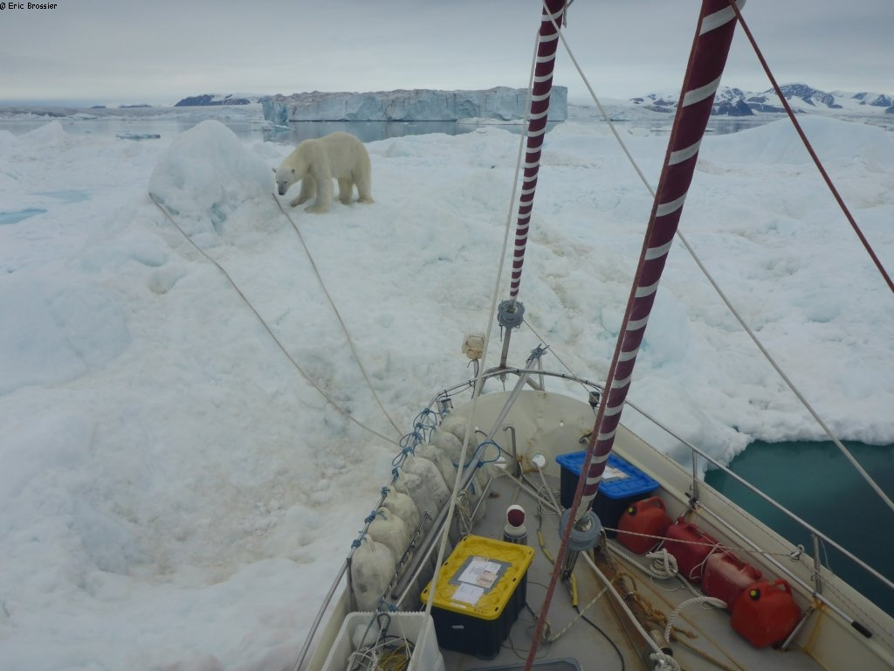

Photos from some of the fieldwork I was lucky enough to be part of. Thanks to all the people I met on the way, which made these adventures extra-fun!

Milne Ice Shelf 2019: Campsite on the ice shelf, glorious day

Amundsen Sea 2020: Out on the zodiac to deploy the vertical microstructure profiler (VMP) to measure turbulence near Dotson Ice Shelf

Talbot Bay 2021: Water bottle sampling near Wykeham Glacier, while moored on a small iceberg. Photo Éric Brossier

Talbot Bay 2021: A visitor. Photo Éric Brossier

Milne Fiord 2022: Alex looking for a spot to dip the CTD near the grounding line of Milne Glacier

Milne Ice Shelf 2023: Oscar taking notes on our very elaborate mooring inside a rift

Milne Ice Shelf 2023: Oscar out for a paddle in a rift

Amundsen Sea 2024: Testing the LISST particule sizer in Pine Island Bay from the RV Araon

